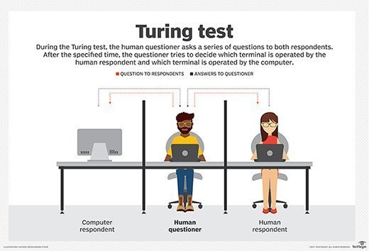

# Pendahuluan

<figure><figcaption></figcaption></figure>

**Definisi Logika Fuzzy**

Logika Fuzzy, atau logika kabur, adalah ekstensi dari logika Boolean yang memungkinkan penanganan konsep yang tidak pasti atau kabur. Berbeda dengan logika klasik yang hanya mengenal dua keadaan—benar atau salah—logika fuzzy memperkenalkan derajat keanggotaan yang berkisar antara 0 dan 1. Ini memungkinkan model lebih kompleks dari ketidakpastian dan ambiguitas, yang sering ditemukan dalam sistem dunia nyata.

**Tujuan dan Ruang Lingkup**

Tujuan dari logika fuzzy adalah untuk memodelkan penalaran dalam situasi yang tidak pasti atau kabur. Ruang lingkupnya meliputi, tetapi tidak terbatas pada, sistem kontrol otomatis, pengambilan keputusan, pengenalan pola, dan analisis data. Logika fuzzy digunakan dalam berbagai disiplin ilmu, termasuk teknik, ilmu komputer, statistik, dan psikologi kognitif.

**Signifikansi dalam Konteks Saat Ini**

Dalam era Big Data dan Internet of Things (IoT), kebutuhan untuk mengolah informasi yang tidak pasti atau kabur menjadi semakin penting. Logika fuzzy menawarkan kerangka kerja yang fleksibel untuk memahami dan memanipulasi data dalam kondisi yang kompleks dan tidak pasti. Ini sangat relevan dalam aplikasi seperti analisis sentimen, diagnostik medis, dan sistem rekomendasi, di mana data sering kali ambigu atau tidak lengkap.

***

Logika fuzzy adalah paradigma yang sangat penting dalam bidang kecerdasan buatan dan ilmu komputer. Dibandingkan dengan logika klasik, logika fuzzy menawarkan keuntungan signifikan dalam menangani masalah yang kompleks dan tidak pasti, yang sering kali terjadi dalam aplikasi dunia nyata. Dengan memperkenalkan konsep derajat keanggotaan, logika fuzzy memungkinkan penalaran yang lebih nuansatif dan adaptif.

Sebagai contoh, dalam sistem kontrol iklim untuk gedung, logika klasik mungkin hanya akan mempertimbangkan dua keadaan: panas atau dingin. Namun, logika fuzzy memungkinkan sistem untuk memahami keadaan seperti "agak panas" atau "sedikit dingin," memungkinkan kontrol yang lebih halus dan responsif terhadap perubahan kondisi.

Dalam konteks kecerdasan buatan, logika fuzzy sering digunakan dalam kombinasi dengan teknik lain seperti jaringan saraf tiruan dan algoritma genetika untuk menciptakan sistem yang lebih robust dan adaptif. Ini memungkinkan mesin untuk "belajar" dari data dan meningkatkan kinerja mereka seiring waktu, sebuah konsep yang sangat penting dalam bidang machine learning dan data science.

Logika fuzzy juga memiliki implikasi etis dan sosial yang signifikan. Dalam sistem pengambilan keputusan otomatis, penggunaan logika fuzzy dapat membantu mengurangi bias dan diskriminasi dengan mempertimbangkan nuansa dan kompleksitas situasi tertentu. Namun, ini juga menimbulkan pertanyaan tentang keamanan data dan privasi, terutama ketika digunakan dalam konteks yang sensitif seperti diagnostik medis atau analisis keuangan.

Secara keseluruhan, logika fuzzy adalah alat yang sangat kuat untuk memodelkan ketidakpastian dan kompleksitas dalam dunia nyata. Dengan kemampuannya untuk menangani ambiguitas dan nuansa, logika fuzzy akan terus memainkan peran kunci dalam pengembangan sistem cerdas dan otomatis di masa depa

